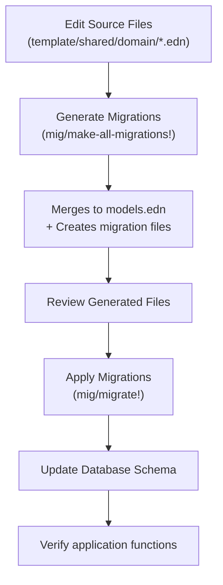

<!-- ai: {:namespaces [app.migrations.simple-repl] :tags [:migrations :database] :kind :overview} -->

# Migration System Overview (Single-Tenant)

Architecture and workflows for the **single-tenant template** migration system.

> [!CAUTION]
> **DO NOT edit `resources/db/models.edn` directly!** This file is auto-generated and will be overwritten.
> 
> ✅ **Edit source files instead:**
> - `resources/db/template/models.edn` - Application-specific entities
> - `resources/db/shared/models.edn` - Shared models across apps
> - `resources/db/domain/models.edn` - Domain-specific models (if exists)
>
> These source files are **merged** into `models.edn` automatically when you run `(mig/make-all-migrations!)`.

## 🏗️ System Architecture

### Core Components

```
┌─ Source Model Definitions ✅ EDIT THESE
│  ├─ resources/db/template/models.edn (app-specific entities)
│  ├─ resources/db/shared/models.edn (shared models)
│  ├─ resources/db/domain/models.edn (domain models, optional)
│  ├─ resources/db/template/triggers.edn (trigger definitions)
│  ├─ resources/db/template/views.edn (view definitions)
│  ├─ resources/db/shared/functions.edn (DB functions)
│  └─ resources/db/shared/policies.edn (RLS policies)
│
├─ Generated Files ❌ DO NOT EDIT
│  └─ resources/db/models.edn (merged from template/shared/domain)
│
├─ Automigrate Library (vendor/automigrate/)
│  ├─ Migration generation from model diffs
│  ├─ Schema synchronization
│  ├─ Forward/backward migration support
│  └─ Multi-file type support (.edn, .sql, .fn, .trg, .pol, .view)
│
├─ Migration Files (resources/db/migrations/) ❌ AUTO-GENERATED
│  ├─ 0001_schema.edn (base schema)
│  ├─ 0002_enable_hstore_extension.sql (extension)
│  ├─ NNNN_function_*.fn (database functions)
│  ├─ NNNN_trigger_*.trg (triggers for audit/usage)
│  ├─ NNNN_policy_*.pol (policy SQL blocks, optional)
│  └─ NNNN_view_*.view (database views)
│
└─ Database Management Scripts (scripts/bb/database/)
   ├─ Development workflow scripts
   ├─ Backup and restore utilities
   ├─ Schema comparison tools
   └─ Legacy helpers
```

### Migration Flow



## 🗃️ Database Schema Structure

### Default entities

Entities are modeled without tenant context. Example:

```sql
CREATE TABLE example_entity (
    id UUID PRIMARY KEY,
    -- entity-specific fields
    created_at TIMESTAMPTZ,
    updated_at TIMESTAMPTZ
);
```

### Field Type System

The system uses centralized field type handling (`app.shared.field-casting`):

```clojure
;; Supported PostgreSQL types with proper casting
:uuid          -> [:cast value :uuid]
:timestamptz   -> [:cast value :timestamptz]
:jsonb         -> [:cast [:lift value] :jsonb]  ;; Prevents HoneySQL flattening
:decimal       -> [:cast value :decimal]
:enum          -> [:cast value :custom-enum-type]
```

## 🔄 Migration Workflow

### 1. Model-Driven Development

```edn
;; resources/db/models.edn
{:new-entity
 {:fields
  [[:id :uuid {:primary-key true}]
   [:name [:varchar 255] {:null false}]
   [:settings :jsonb {:default "{}"}]
   [:created_at :timestamptz]
   [:updated_at :timestamptz]]

  :indexes
  [[:idx_new_entity_created :btree {:fields [:created_at]}]]}}
```

### 2. Migration generation & application (simple REPL workflow)

```clojure
(require '[app.migrations.simple-repl :as mig])

;; Merge hierarchical models -> schema migration -> extended migrations
(mig/make-all-migrations!)

;; Apply pending migrations (default :dev)
(mig/migrate!)
(mig/status)
```

Use the same REPL entrypoints for test or other profiles:

```clojure
(mig/migrate! :test)
(mig/status :test)
```

## 📊 Migration File Types

### 1. Schema Migrations (.edn)
Auto-generated from model changes:
```edn
{:create-table
 {:table-name :new-entity
  :columns [...columns...]
  :indexes [...indexes...]}}
```

### 2. SQL Migrations (.sql)
Manual SQL operations:
```sql
-- Migration: Enable hstore extension
CREATE EXTENSION IF NOT EXISTS hstore;
```

### 3. Function Migrations (.fn)
Database function definitions:
```sql
CREATE OR REPLACE FUNCTION normalize_name(name text)
RETURNS text AS $$
BEGIN
    RETURN trim(lower(name));
END;
$$ LANGUAGE plpgsql IMMUTABLE;
```

### 4. Trigger Migrations (.trg)
Automated triggers for audit/usage:
```sql
CREATE TRIGGER audit_properties
    AFTER INSERT OR UPDATE OR DELETE ON properties
    FOR EACH ROW EXECUTE FUNCTION audit_table_changes();
```

### 5. Policy Migrations (.pol)
Optional policy SQL blocks if you add custom policies:
```sql
-- Example policy block
CREATE POLICY example_policy
    ON example_entity
    USING (true);
```

### 6. View Migrations (.view)
Database view definitions:
```sql
CREATE VIEW v_properties_summary AS
SELECT id, name, created_at
FROM properties
WHERE archived_at IS NULL;
```

## 🔧 Development Workflow

### Daily Development

```bash
# 1. (Optional) Start with clean database
bb clean-db --dev

# 2. Make model changes in SOURCE files:
#    ✅ resources/db/template/models.edn
#    ✅ resources/db/shared/models.edn
#    ✅ resources/db/domain/models.edn
#
#    ❌ DO NOT edit resources/db/models.edn (it's auto-generated)

# 3. From a REPL, generate and apply migrations
# (require '[app.migrations.simple-repl :as mig])
# (mig/make-all-migrations!)  ; Merges template/shared/domain → models.edn, generates migrations
# (mig/migrate!)              ; Applies migrations to database

# 4. Test the application
bb run-app  # runs scripts/sh/development/run-app.sh and starts the live-reload dev stack
```

### Schema Updates

```bash
# Compare database with models
bb scripts/bb/database/compare_with_models.clj

# Compare different environments
bb scripts/bb/database/compare_db_schemas.clj dev test

# Backup before major changes
bb backup-db --dev
```

## 📈 Performance Considerations

### Indexing Strategy
- Composite indexes for common query patterns
- JSONB indexes for metadata searches
- Time-based indexes for audit and usage queries

### Connection Pooling
- Maximum 20 connections per environment
- Leak detection for long-running queries
- Connection validation and timeout handling

### Query Optimization
- Prepared statements for common operations
- JSONB field casting prevents query plan issues

## ⚠️ Common Mistakes & Troubleshooting

### "My model changes disappeared after regenerating migrations!"

**Problem**: You edited `resources/db/models.edn` directly, and your changes were overwritten.

**Solution**:
1. ❌ Never edit `resources/db/models.edn` - it's auto-generated
2. ✅ Edit source files in `resources/db/{template,shared,domain}/models.edn` instead
3. Run `(mig/make-all-migrations!)` - this merges sources → `models.edn`

### File Structure Guide

```
resources/db/
├── models.edn                    ❌ Generated - DON'T EDIT
│
├── template/                     ✅ Edit application models here
│   ├── models.edn               
│   ├── triggers.edn             
│   ├── policies.edn             
│   └── views.edn                
│
├── shared/                       ✅ Edit shared models here
│   ├── models.edn               
│   ├── functions.edn            
│   ├── triggers.edn             
│   ├── policies.edn             
│   └── views.edn                
│
├── domain/                       ✅ Edit domain models here (optional)
│   └── models.edn               
│
└── migrations/                   ❌ Auto-generated - DON'T EDIT
    ├── 0001_schema.edn
    ├── 0002_*.sql
    └── ...
```

### "I accidentally edited models.edn, what now?"

1. **Restore your changes**: If you made changes to `models.edn`, manually copy them to the correct source file (`template/models.edn` or `shared/models.edn`)
2. **Regenerate**: Run `(mig/make-all-migrations!)` to merge sources properly
3. **Verify**: Check that `models.edn` now contains your changes after the merge

### "How do I know which file to edit?"

| What you're changing | Edit this file |
|---------------------|----------------|
| App-specific entities (users, orders, etc.) | `resources/db/template/models.edn` |
| Shared/common entities | `resources/db/shared/models.edn` |
| Database functions | `resources/db/shared/functions.edn` |
| Triggers | `resources/db/template/triggers.edn` |
| Views | `resources/db/template/views.edn` |
| RLS policies | `resources/db/shared/policies.edn` |

---

*This overview provides the foundation for understanding the complete migration system. See specific guides for detailed implementation instructions.*
